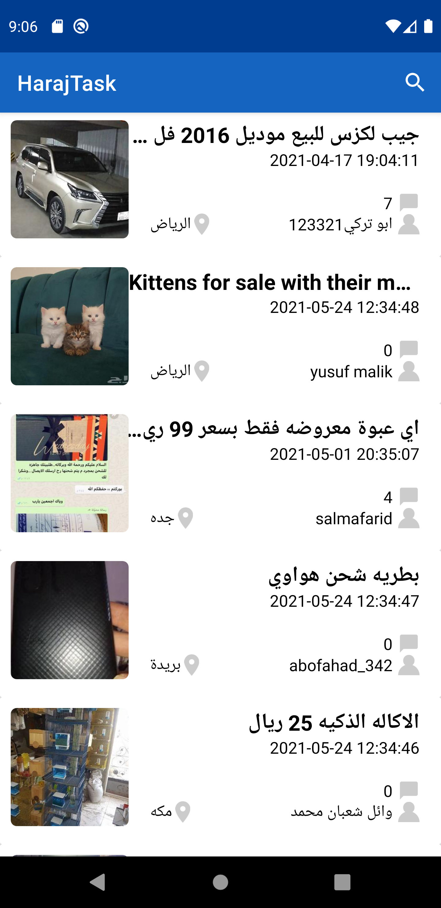
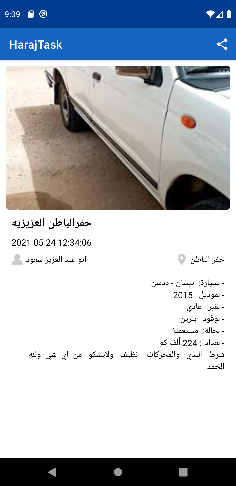

## Haraj Task

Haraj Task is an application built to demonstrate core Kotlin and Android Development skills.

The application utilizes the following libraries:

* [Retrofit](https://square.github.io/retrofit/) to make API calls to an HTTP web service (in the case of this app, it points to the [JSON file hosted on this forked repo here](https://raw.githubusercontent.com/mhmdcs/HarajAndroidChallenge/main/app/src/main/assets/data.json))
* [Moshi](https://github.com/square/moshi) which handles the deserialization of the returned JSON to Kotlin data objects. 
* [Glide](https://bumptech.github.io/glide/) to load and cache images by URL.
* [Room](https://developer.android.com/training/data-storage/room) for local database storage.
* [Coroutines](https://kotlinlang.org/docs/coroutines-overview.html) for background-threading.
  
It leverages the following components from the Jetpack library:

* [ViewModel](https://developer.android.com/topic/libraries/architecture/viewmodel).
* [RecyclerView](https://developer.android.com/jetpack/androidx/releases/recyclerview).
* [LiveData](https://developer.android.com/topic/libraries/architecture/livedata).
* [Data Binding](https://developer.android.com/topic/libraries/data-binding/) with binding adapters.
* [Navigation](https://developer.android.com/topic/libraries/architecture/navigation/) with the SafeArgs plugin for parameter passing between fragments.

## Screenshots

<table>
<tr>
<td></td>
<td></td>
</tr>
</table>

